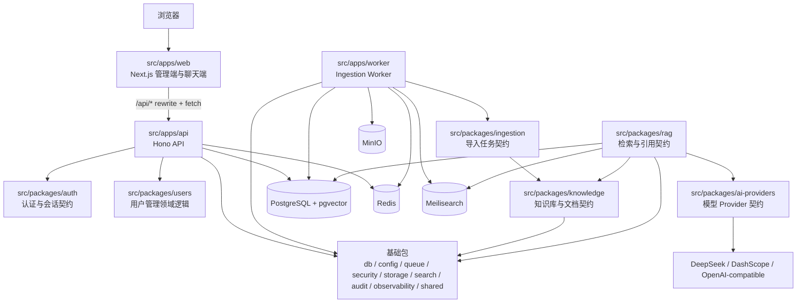

# 知识库 AI 助手

企业级知识库 AI 助手，面向单企业私有化交付场景。项目采用模块化单体加独立 Worker 的 monorepo 架构，目标是把文档、网页等知识来源接入统一知识库，并提供基于权限过滤、混合检索、引用溯源和审计记录的 AI 问答能力。

当前代码已经从初始脚手架推进到功能 MVP 阶段：前端有完整中文多路由工作台，API 已接入认证、会话、用户管理、限流和数据库运行时，数据库 schema 与迁移已建立；知识库、文档、任务、日志、模型服务、审计和聊天页面目前仍主要依赖前端 mock 数据或领域契约，RAG/ingestion 真实链路尚未打通。

## 技术栈

| 层级 | 技术 |
| --- | --- |
| Monorepo | pnpm workspace、Turborepo、TypeScript strict |
| 前端 | Next.js 16 App Router、React 19.2、Tailwind CSS、TanStack Query、lucide-react |
| API | Hono、Hono RPC 类型客户端、Zod、Better Auth、Redis 限流 |
| Worker | Node.js、tsx、队列契约预留 ingestion worker 生命周期 |
| 数据库 | PostgreSQL 17、pgvector、Drizzle ORM、drizzle-kit |
| 检索与存储 | Meilisearch、MinIO/S3-compatible object storage、pgvector |
| 测试与质量 | Vitest、Playwright、ESLint、Prettier |
| 本地基础设施 | Docker Compose: PostgreSQL、Redis、Meilisearch、MinIO |

## 架构图



## 目录结构

```text
.
├── compose.yaml                  # 本地 PostgreSQL、Redis、Meilisearch、MinIO
├── docs/superpowers/             # 设计文档和阶段计划
├── e2e/                          # Playwright 端到端用例
├── src/apps/
│   ├── web/                      # Next.js App Router 前端
│   ├── api/                      # Hono API、认证/用户路由、运行时服务装配
│   └── worker/                   # Worker 生命周期入口
├── src/packages/
│   ├── auth/                     # 角色、会话、登录输入、Better Auth 服务边界
│   ├── users/                    # 用户管理 schemas、plans、service operations
│   ├── db/                       # Drizzle schema、迁移、数据库客户端、开发种子
│   ├── config/                   # 运行时环境变量校验与脱敏
│   ├── queue/                    # ingestion job 与队列契约
│   ├── knowledge/                # 知识库/文档领域契约
│   ├── ingestion/                # 导入任务状态与步骤契约
│   ├── rag/                      # 检索候选与引用契约
│   ├── ai-providers/             # chat/embedding/rerank provider 契约
│   ├── search/                   # 检索后端与授权范围契约
│   ├── storage/                  # 对象存储配置与文档对象 key
│   ├── security/                 # hash、cookie、限流 identity 等安全工具
│   ├── audit/                    # 审计领域契约
│   ├── observability/            # 结构化日志与脱敏
│   └── shared/                   # API envelope、时间、公共类型
├── package.json                  # 根脚本和工具链依赖
├── pnpm-workspace.yaml           # workspace: src/apps/*、src/packages/*
└── turbo.json                    # dev/build/typecheck/lint/test 编排
```

## 启动配置

### 1. 环境要求

- Node.js `>=20.19.0`
- pnpm `>=10.0.0`，当前仓库声明 `pnpm@11.1.1`
- Docker 与 Docker Compose

### 2. 安装依赖

```bash
pnpm install --ignore-scripts
```

### 3. 准备环境变量

```bash
cp .env.example .env
```

本地开发建议至少填充这些值：

```dotenv
DATABASE_URL=${DATABASE_URL}
REDIS_URL=${REDIS_URL}
MEILISEARCH_HOST=${MEILISEARCH_HOST}
MEILISEARCH_MASTER_KEY=${MEILISEARCH_MASTER_KEY}
S3_ENDPOINT=${S3_ENDPOINT}
S3_BUCKET=${S3_BUCKET}
S3_ACCESS_KEY_ID=${S3_ACCESS_KEY_ID}
S3_SECRET_ACCESS_KEY=${S3_SECRET_ACCESS_KEY}
BETTER_AUTH_SECRET=${BETTER_AUTH_SECRET}
APP_ENCRYPTION_KEY=${APP_ENCRYPTION_KEY}
```

前端单独的环境样例在 `src/apps/web/.env.example`，对应变量为 `NEXT_PUBLIC_API_BASE_URL=${NEXT_PUBLIC_API_BASE_URL}`。API 和 Worker 环境样例分别在 `src/apps/api/.env.example` 与 `src/apps/worker/.env.example`。

### 4. 启动本地依赖服务

```bash
docker compose up -d postgres redis meilisearch minio
```

服务端口：

| 服务 | 地址 |
| --- | --- |
| PostgreSQL | `localhost:5432` |
| Redis | `localhost:6379` |
| Meilisearch | `http://localhost:7700` |
| MinIO API | `http://localhost:9000` |
| MinIO Console | `http://localhost:9001` |

### 5. 初始化数据库

```bash
pnpm db:migrate
pnpm --filter @kb/db seed:dev-auth
```

开发种子会创建默认租户和两个本地账号：

| 角色 | 邮箱 | 密码 |
| --- | --- | --- |
| admin | `admin@example.com` | `password123` |
| member | `member@example.com` | `password123` |

`seed:dev-auth` 在 `NODE_ENV=production` 下会拒绝执行。

### 6. 启动应用

```bash
pnpm dev
```

默认端口：

- Web: `http://127.0.0.1:3000`
- API: `http://localhost:4000`

Next.js 已配置 `/api/:path*` rewrite 到 `http://localhost:4000/api/:path*`。

### 7. 常用质量命令

```bash
pnpm typecheck
pnpm lint
pnpm test
pnpm build
pnpm test:integration
pnpm test:e2e
```

也可以按 package 定向执行：

```bash
pnpm --filter @kb/web test
pnpm --filter @kb/api test
pnpm --filter @kb/db typecheck
```

## 当前项目进度

已完成：

- Monorepo 基础：pnpm workspace、Turborepo、strict TypeScript、ESLint、Prettier、Vitest、Playwright。
- 本地基础设施：`compose.yaml` 提供 PostgreSQL/pgvector、Redis、Meilisearch、MinIO。
- 前端功能 MVP：登录、知识库、文档、文档详情、聊天、任务、处理日志、模型服务、用户、审计、未授权页和加载态已具备中文界面与核心交互。
- API 基础：Hono app、请求 ID、健康检查、统一响应 envelope、认证路由、用户管理路由、CSRF/content-type/admin guard、Redis/in-memory rate limiter。
- 认证与用户管理：Better Auth 服务边界、会话契约、固定 `admin/member` 角色、用户 CRUD/service plans、开发种子账号。
- 数据库：Drizzle schema 覆盖租户、认证、知识库、ingestion、RAG、Provider、审计、系统配置等核心实体；已有 4 个迁移文件和迁移脚本。
- 后端结构：API routes、contracts、auth service、users package 已拆分为更细模块，入口保持兼容。
- 基础领域包：`knowledge`、`ingestion`、`rag`、`ai-providers`、`search`、`storage`、`queue` 等已建立 typed public entrypoints 和基础测试。

进行中或待实现：

- 知识库、文档、任务、日志、Provider、审计等页面仍主要依赖前端 mock 数据，尚未全面接入真实 API。
- Worker 当前只有生命周期与队列名称初始化，尚未连接 BullMQ 执行导入任务。
- 文件上传、URL 抓取、解析、chunking、embedding、索引写入的 ingestion pipeline 尚未落地。
- RAG 查询链路尚未接入真实 pgvector/Meilisearch 检索、rerank、LLM 回答生成和引用回写。
- Provider 密钥配置 UI 已有 MVP 交互，但真实加密存储、连接测试和审计闭环仍待接入。
- 生产部署、备份恢复、监控采集和外部 OpenAPI 输出仍需补齐。
